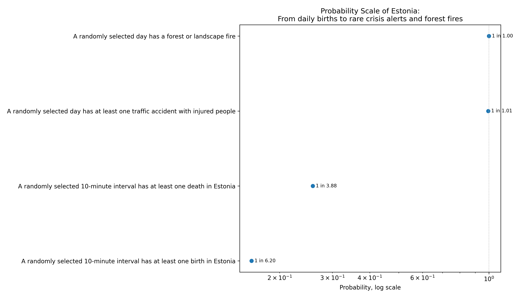

# Probability Scale of Estonia

**From everyday events to rarer nature and traffic events**

This project is a solution for the **RMK data team internship 2026 test challenge**.

The goal of the challenge is to create a probability scale: a list of events with their probabilities, so that readers can develop a better intuition for probability.

I chose events that are understandable to everyday readers and also relevant to environmental and public-sector data work.

## Quick start

Install the project in editable mode:

```bash
python -m pip install -e ".[dev]"
```

Download the raw data:

```bash
python scripts/fetch_data.py
```

Run the full pipeline:

```bash
python scripts/run_pipeline.py
```

Or run everything in one step:

```bash
python scripts/run_all.py
```

Run tests:

```bash
python -m pytest
```

The main output is saved to:

```text
outputs/figures/probability_scale.png
```

The processed table is saved to:

```text
data/processed/probability_scale.csv
```

## Example output



## Project idea

People usually understand distances better than probabilities.

For example, a few centimetres can be held in one hand, metres are useful for buildings and rooms, and kilometres are used for distances between cities.

Probabilities are harder to understand intuitively. A probability such as `0.01` or `0.0001` is mathematically simple, but it is not always obvious whether it represents something common or rare.

This project tries to make probabilities easier to understand by converting public Estonian data into “1 in X” statements.

For example:

```text
1 in 6.2 random 10-minute intervals
```

is easier to understand than:

```text
0.161
```

## Current scope

The main probability scale focuses on one comparable probability type:

```text
Probability that at least one event happens in a random 10-minute interval.
```

This keeps the visual comparison fair and easy to understand.

Currently implemented interval events include:

- birth in Estonia
- death in Estonia
- traffic accident with injured people
- forest or landscape fire

The project also contains logic for additional record-share calculations, such as seasonal shares, but those are documented separately because they answer a different type of question.

## Important distinction

Not every probability means the same thing.

For example:

```text
Death in Estonia in a random 10-minute interval
```

means:

```text
If we randomly select one 10-minute interval, what is the probability that at least one death happens in Estonia during that interval?
```

But this:

```text
Traffic accident with injuries happened in summer
```

means:

```text
If we randomly select one traffic accident record, what is the probability that it happened in summer?
```

These are both probabilities, but they answer different questions.

Because of this, the processed dataset includes a column named:

```text
probability_type
```

Possible values include:

```text
interval_event_probability
record_share
```

The main visual scale is intended for interval event probabilities. Record-share probabilities are useful, but they should not be interpreted as personal risk.

## Data sources

The project uses public Estonian datasets.

### Statistics Estonia RV030

Used for:

- births
- deaths

Source:

```text
https://andmed.stat.ee/et/stat/RV030
```

The data is downloaded programmatically through the Statistics Estonia PxWeb API.

### Statistics Estonia TS093

Used for:

- traffic accidents with injured people

Source:

```text
https://andmed.stat.ee/et/stat/TS093
```

The data is downloaded programmatically through the Statistics Estonia PxWeb API.

### Forest and landscape fires

Used for:

- forest and landscape fire events

Source:

```text
https://andmed.eesti.ee/datasets/metsa-ja-maastikutulekahjud
```

The CSV files are downloaded programmatically from the public open data source.

More detailed source notes are available in:

```text
references/sources.md
```

## Method

For event-frequency probabilities, I use a simple Poisson approximation.

The idea is:

```text
event_rate = event_count / number_of_intervals
```

Then:

```text
P(at least one event in a random interval) = 1 - exp(-event_rate)
```

In this project, one interval is:

```text
10 minutes
```

There are:

```text
24 * 6 = 144
```

ten-minute intervals in one day.

This means the yearly number of intervals is:

```text
365 * 144
```

or:

```text
366 * 144
```

for leap years.

## Output table

The processed output table contains these columns:

```text
event
category
probability
one_in_x
probability_type
interpretation
source_name
source_url
notes
```

The `one_in_x` column is used for the visual scale because it is easier for readers to understand than raw probability values.

## Project structure

```text
rmk-probability-scale/
|-- data/
|   |-- raw/
|   |-- interim/
|   `-- processed/
|       `-- probability_scale.csv
|
|-- docs/
|   `-- approach.md
|
|-- outputs/
|   `-- figures/
|       `-- probability_scale.png
|
|-- references/
|   `-- sources.md
|
|-- scripts/
|   |-- fetch_data.py
|   |-- make_plot.py
|   |-- run_all.py
|   `-- run_pipeline.py
|
|-- src/
|   `-- probability_scale/
|       |-- config.py
|       |-- forest_fire.py
|       |-- ingest.py
|       |-- pipeline.py
|       |-- plotting.py
|       |-- population.py
|       |-- traffic.py
|       `-- transform.py
|
|-- tests/
|   `-- test_smoke.py
|
|-- README.md
|-- LICENSE.md
`-- pyproject.toml
```

## Reproducibility

The project is designed to be reproducible.

The workflow is:

```text
download raw data
        ↓
calculate probabilities
        ↓
save processed CSV
        ↓
create probability scale plot
        ↓
run smoke tests
```

The raw data can be downloaded again with:

```bash
python scripts/fetch_data.py
```

The processed table and plot can be regenerated with:

```bash
python scripts/run_pipeline.py
```

## Tests

The project includes smoke tests that check:

- the probability table has the required columns
- probability values are valid
- `one_in_x` values are positive
- the plot can be created
- the table does not contain placeholder values
- the table has enough real events for the current scope

Run tests with:

```bash
python -m pytest
```

## Limitations

The probabilities in the main scale are event-frequency probabilities, not personal risk probabilities.

For example, the traffic accident probability does not mean that one person has that exact chance of being in an accident during a 10-minute interval.

Actual personal risk depends on many factors, such as:

- location
- behaviour
- age
- time spent in traffic
- season
- weather
- exposure to risk

The purpose of the project is not to calculate personal risk, but to create an intuitive probability scale from public data.

Another limitation is that different datasets may have different time ranges, update frequencies and definitions.

## Future improvements

Possible future improvements:

- add more RMK-specific forest indicators
- add EE-ALARM crisis alert probabilities
- add uncertainty intervals
- compare counties or regions
- add Bayesian reasoning for rare events
- create a small Power BI or Streamlit version
- add a separate figure for record-share probabilities
- improve the visual design further

## AI usage

AI assistance was used for brainstorming, planning the repository structure, drafting documentation, and improving code organization.

The implementation was run, tested and adjusted locally.